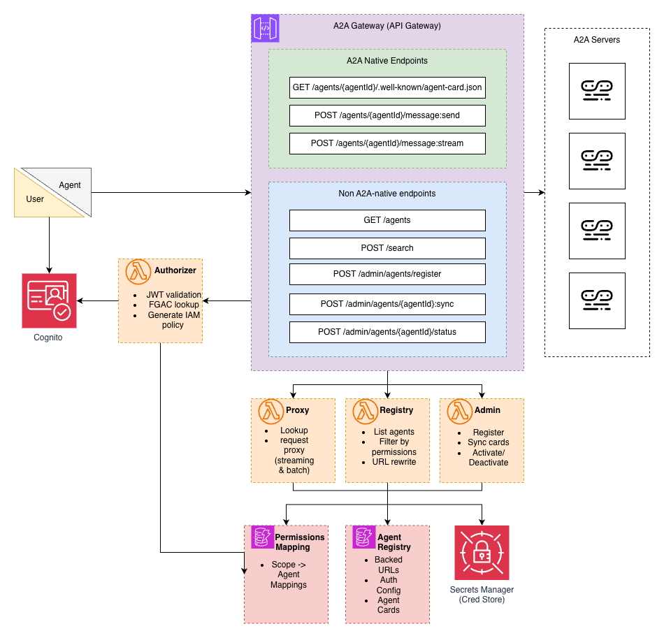

# A2A Gateway

by Reilly Manton, Wesley Petry, Scott Wainner

A production-ready, serverless A2A gateway that provides the complete three-layer architecture required for enterprise agent deployments: management, control, and data layers.

## Why This Matters

Amazon Bedrock AgentCore provides a complete gateway solution for MCP (Model Context Protocol) with management, access control, and data proxying. However, AgentCore has no native support for A2A (Agent-to-Agent) protocol. Existing A2A solutions only implement a management layer (agent discovery/registry) but lack the control and data layers, rendering them ineffective for corporate environments where security, access control, and centralized routing are critical.

This gateway fills that gap by implementing all three layers:

### The Three-Layer Architecture

**Management Layer** - Agent Discovery & Registry
- Centralized agent registry with metadata and capabilities
- Dynamic agent card caching and URL rewriting
- Agent lifecycle management (register, sync, activate/deactivate)
- Multi-backend support (standard A2A + Bedrock AgentCore)

**Control Layer** - Fine-Grained Access Control (FGAC)
- JWT-based authentication via Cognito
- Scope-based permissions (who can access which agents)
- Lambda authorizer generates agent-specific IAM policies
- Unauthorized requests blocked at API Gateway level (never reach Lambdas)
- 5-minute policy caching for performance
- Audit trail through CloudWatch logs

**Data Layer** - Centralized Request Proxying
- Single domain endpoint for all agents (`/agents/{agentId}`)
- OAuth 2.0 client credentials flow for backend authentication
- SSE streaming support for real-time responses
- Request/response transformation and validation

## What This Does

The gateway hosts multiple A2A agents at a single domain with path-based routing (`/agents/{agentId}`). Each path acts as an independent A2A server from the client's perspective - **standard A2A clients work without modification**.

**Key Features**:
- ✅ Fully A2A protocol compliant
- ✅ Fine-grained access control via Cognito JWT scopes
- ✅ Semantic search for agent discovery via S3 Vectors
- ✅ SSE streaming support for `message:stream` operations
- ✅ OAuth 2.0 Client Credentials flow for backend authentication
- ✅ Serverless architecture (API Gateway + Lambda + DynamoDB)
- ✅ Native support for AWS Bedrock AgentCore Runtime backends
- ✅ Automatic protocol translation (HTTP A2A ↔ JSON-RPC for Bedrock)

## Architecture



### Components

**API Gateway (REST API)**
- Two static routes that never change when agents are added/removed
- Lambda authorizer for JWT validation and FGAC
- Response streaming enabled via Lambda Web Adapter

**Lambda Functions**
- **Authorizer**: JWT validation, FGAC lookup in DynamoDB, generates IAM policies with agent-specific resource ARNs
- **Registry**: Agent discovery with permission filtering (returns only agents user can access)
- **Search**: Semantic agent discovery using S3 Vectors embeddings
- **Proxy** (Container): Routes A2A requests to backends with OAuth authentication, supports real-time SSE streaming via FastAPI + Lambda Web Adapter
- **Admin**: Agent registration and management (requires `gateway:admin` scope)

**DynamoDB Tables**
- **AgentRegistry**: Maps agent IDs to backend URLs, auth configs, cached agent cards
- **Permissions**: Maps user scopes to allowed agents

**Secrets Manager**
- Stores OAuth client secrets for backend authentication
- Secrets referenced by ARN, never stored in DynamoDB

### A2A Operations Supported

All standard A2A operations work through the gateway:

- `POST /agents/{agentId}/message:send` - Send message (buffered)
- `POST /agents/{agentId}/message:stream` - Send message (SSE streaming)
- `GET /agents/{agentId}/.well-known/agent-card.json` - Get Agent Card
- `GET /agents/{agentId}/tasks` - List tasks
- `GET /agents/{agentId}/tasks/{taskId}` - Get task status
- `POST /agents/{agentId}/tasks/{taskId}:cancel` - Cancel task

### Backend Support

The gateway supports two types of A2A backends:

**Standard A2A Servers**

Standard HTTP-based A2A servers that implement the A2A protocol directly. The gateway forwards HTTP requests as-is with OAuth authentication.

**AWS Bedrock AgentCore Runtime**

The gateway provides native support for agents deployed on AWS Bedrock AgentCore Runtime. It automatically:

1. **Detects Bedrock backends** - Identifies backends by URL pattern (`bedrock-agentcore`)
2. **Protocol translation** - Converts HTTP A2A to JSON-RPC format:
   - `message:send` → `message/send` (colon to slash)
   - Wraps requests in JSON-RPC envelopes
3. **Format transformation** - Adapts A2A conventions to Bedrock format:
   - `ROLE_USER` → `user`
   - `ROLE_AGENT` → `agent`
4. **Session management** - Adds required `X-Amzn-Bedrock-AgentCore-Runtime-Session-Id` headers
5. **Endpoint routing** - Routes all operations to `/invocations` endpoint

This means standard A2A clients can seamlessly interact with Bedrock AgentCore agents through the gateway without any client-side changes.

## Quick Start

### Prerequisites

- Terraform >= 1.5.0
- Python 3.12
- AWS CLI configured
- Finch (container runtime) - [Install Finch](https://github.com/runfinch/finch)
- S3 bucket for Terraform state

### 1. Configure Terraform Backend (for remote tfstate)

Edit `terraform/backend.tf` - uncomment and set your S3 bucket:

```hcl
terraform {
  backend "s3" {
    bucket         = "your-terraform-state-bucket"
    key            = "a2a-gateway/terraform.tfstate"
    region         = "us-east-1"
    encrypt        = true
  }
}
```

### 2. Set Variables

```bash
cd terraform
cp terraform.tfvars.example terraform.tfvars
```

Edit `terraform.tfvars` (set your region and naming preferences):
```hcl
aws_region   = "us-east-1"  # or your preferred region
project_name = "a2a-gateway"
environment  = "poc"
```

### 3. Build Lambda Package

Build the zip package for non-container Lambdas (Authorizer, Registry, Admin):

```bash
./scripts/build_lambda_package.sh
```

### 4. Deploy

```bash
cd terraform
terraform init
terraform plan  # Review what will be created
terraform apply
```

This creates everything in one go:
- DynamoDB tables (AgentRegistry, Permissions)
- Cognito User Pool
- ECR repository for the proxy container
- Builds and pushes the proxy container image (requires Finch)
- 4 Lambda functions (Authorizer, Registry, Proxy container, Admin)
- API Gateway with Lambda Authorizer and response streaming
- IAM roles and policies
- Secrets Manager setup
- Automatically updates Lambda env vars with the API Gateway URL

**Note**: The proxy Lambda is container-based to support response streaming. Terraform automatically builds and pushes the container image to ECR during deployment.

### 5. (Optional) Seed Example Permissions

```bash
cd ..
python3 scripts/seed_permissions.py <permissions-table-name> us-east-1
```

Get the table name from Terraform outputs: `terraform output permissions_table_name`

## Using the Gateway

### 1. Get Authentication Token

Export your gateway URL and obtain a JWT token:

```bash
# Get gateway configuration
GATEWAY_URL=$(cd terraform && terraform output -raw api_gateway_url)
TOKEN_ENDPOINT=$(cd terraform && terraform output -raw cognito_token_endpoint)
CLIENT_ID=$(cd terraform && terraform output -raw cognito_client_id)
CLIENT_SECRET=$(cd terraform && terraform output -raw cognito_client_secret)

# Obtain JWT with required scopes
TOKEN_RESPONSE=$(curl -s -X POST $TOKEN_ENDPOINT \
  -H "Content-Type: application/x-www-form-urlencoded" \
  -d "grant_type=client_credentials&client_id=$CLIENT_ID&client_secret=$CLIENT_SECRET&scope=a2a-gateway/gateway:admin a2a-gateway/billing:read")

export JWT=$(echo $TOKEN_RESPONSE | jq -r .access_token)
echo "JWT obtained: ${JWT:0:50}..."
```

### 2. Register Backend Agents

The gateway supports two types of A2A backends:

#### Standard A2A Server

```bash
curl -X POST $GATEWAY_URL/admin/agents/register \
  -H "Authorization: Bearer $JWT" \
  -H "Content-Type: application/json" \
  -d '{
    "agentId": "my-agent",
    "name": "My Custom Agent",
    "backendUrl": "https://your-backend.example.com",
    "agentCardUrl": "https://your-backend.example.com/.well-known/agent-card.json",
    "authConfig": {
      "type": "oauth2_client_credentials",
      "tokenUrl": "https://your-auth.example.com/oauth/token",
      "clientId": "your-client-id",
      "clientSecret": "your-client-secret",
      "scopes": ["agent:invoke"]
    }
  }'
```

#### AWS Bedrock AgentCore Runtime

```bash
# URL-encode your agent ARN
AGENT_ARN="arn:aws:bedrock-agentcore:us-east-1:123456789012:runtime/my-agent-xyz"
ENCODED_ARN=$(python3 -c "import urllib.parse; print(urllib.parse.quote('$AGENT_ARN', safe=''))")

curl -X POST $GATEWAY_URL/admin/agents/register \
  -H "Authorization: Bearer $JWT" \
  -H "Content-Type: application/json" \
  -d "{
    \"agentId\": \"bedrock-agent\",
    \"name\": \"Bedrock Calculator Agent\",
    \"backendUrl\": \"https://bedrock-agentcore.us-east-1.amazonaws.com/runtimes/${ENCODED_ARN}/invocations\",
    \"agentCardUrl\": \"https://bedrock-agentcore.us-east-1.amazonaws.com/runtimes/${ENCODED_ARN}/invocations/.well-known/agent-card.json\",
    \"authConfig\": {
      \"type\": \"oauth2_client_credentials\",
      \"tokenUrl\": \"https://your-cognito-domain.auth.us-east-1.amazoncognito.com/oauth2/token\",
      \"clientId\": \"your-bedrock-client-id\",
      \"clientSecret\": \"your-bedrock-client-secret\",
      \"scopes\": [\"your-resource-server/read\", \"your-resource-server/write\"]
    }
  }"
```

**Note**: The gateway automatically detects Bedrock AgentCore backends and handles protocol translation transparently.

### 3. Discover Agents

List all agents you have access to:

```bash
curl $GATEWAY_URL/agents \
  -H "Authorization: Bearer $JWT" | jq .
```

Example response:
```json
[
  {
    "name": "Calculator Agent",
    "description": "A calculator agent that can perform basic arithmetic operations.",
    "url": "https://your-gateway.execute-api.us-east-1.amazonaws.com/v1/agents/bedrock-agent",
    "protocolVersion": "0.3.0",
    "skills": [
      {
        "id": "calculator",
        "name": "calculator",
        "description": "Calculator powered by SymPy..."
      }
    ],
    "capabilities": {
      "streaming": true
    }
  }
]
```

### 4. Semantic Search for Agents

Search for agents using natural language queries:

```bash
curl -X POST $GATEWAY_URL/search \
  -H "Authorization: Bearer $JWT" \
  -H "Content-Type: application/json" \
  -d '{"query": "calculator math arithmetic", "topK": 5}' | jq .
```

Example response:
```json
{
  "results": [
    {
      "agentCard": {
        "name": "Calculator Agent",
        "description": "A calculator agent that can perform basic arithmetic operations.",
        "url": "https://your-gateway.execute-api.us-east-1.amazonaws.com/v1/agents/bedrock-agent"
      },
      "score": 0.89
    }
  ],
  "query": "calculator math arithmetic",
  "totalMatches": 1
}
```

The search uses Amazon Titan Text Embeddings V2 to generate vector embeddings stored in S3 Vectors. Results are filtered by user permissions - you only see agents you have access to.

### 5. Get Agent Card

Fetch a specific agent's capabilities:

```bash
curl $GATEWAY_URL/agents/bedrock-agent/.well-known/agent-card.json \
  -H "Authorization: Bearer $JWT" | jq .
```

### 6. Send Messages to Agents

Send a message to an agent (buffered response):

```bash
curl -X POST $GATEWAY_URL/agents/bedrock-agent/message:send \
  -H "Authorization: Bearer $JWT" \
  -H "Content-Type: application/json" \
  -d '{
    "message": {
      "messageId": "msg-123",
      "role": "ROLE_USER",
      "parts": [{"text": "Calculate 2 + 2"}]
    }
  }' | jq .
```

Example response (streaming chunks from Bedrock AgentCore):
```json
[
  {
    "contextId": "a1a7915d-078b-478c-a7b5-9c23a4883a8c",
    "kind": "message",
    "messageId": "b8f185a5-fecd-4736-be3c-4d48806e66c2",
    "parts": [{"kind": "text", "text": "The result of"}],
    "role": "agent",
    "taskId": "5be2cf00-6c20-4e2f-a4d4-7e0f90f47c8f"
  },
  {
    "contextId": "a1a7915d-078b-478c-a7b5-9c23a4883a8c",
    "kind": "message",
    "messageId": "fbb7e32e-bfee-439b-8bca-9b2f50f227ad",
    "parts": [{"kind": "text", "text": " 2 + 2 is"}],
    "role": "agent",
    "taskId": "5be2cf00-6c20-4e2f-a4d4-7e0f90f47c8f"
  },
  {
    "contextId": "a1a7915d-078b-478c-a7b5-9c23a4883a8c",
    "kind": "message",
    "messageId": "ad214099-d7d2-4b3e-931b-e363a4edde84",
    "parts": [{"kind": "text", "text": " **4**."}],
    "role": "agent",
    "taskId": "5be2cf00-6c20-4e2f-a4d4-7e0f90f47c8f"
  }
]
```

### 6. Stream Responses

For streaming responses (SSE):

```bash
curl -X POST $GATEWAY_URL/agents/bedrock-agent/message:stream \
  -H "Authorization: Bearer $JWT" \
  -H "Content-Type: application/json" \
  -d '{
    "message": {
      "messageId": "msg-456",
      "role": "ROLE_USER",
      "parts": [{"text": "What is 101 * 11?"}]
    }
  }'
```

### Complete Workflow Example

```bash
# 1. Get JWT
TOKEN_RESPONSE=$(curl -s -X POST $TOKEN_ENDPOINT \
  -H "Content-Type: application/x-www-form-urlencoded" \
  -d "grant_type=client_credentials&client_id=$CLIENT_ID&client_secret=$CLIENT_SECRET&scope=a2a-gateway/gateway:admin a2a-gateway/billing:read")
export JWT=$(echo $TOKEN_RESPONSE | jq -r .access_token)

# 2. Discover agents
curl $GATEWAY_URL/agents -H "Authorization: Bearer $JWT" | jq '.[].name'

# 3. Get agent card
curl $GATEWAY_URL/agents/bedrock-agent/.well-known/agent-card.json \
  -H "Authorization: Bearer $JWT" | jq '.skills[].name'

# 4. Send message
curl -X POST $GATEWAY_URL/agents/bedrock-agent/message:send \
  -H "Authorization: Bearer $JWT" \
  -H "Content-Type: application/json" \
  -d '{
    "message": {
      "messageId": "msg-001",
      "role": "ROLE_USER",
      "parts": [{"text": "Calculate the square root of 144"}]
    }
  }' | jq '.[].parts[].text' | tr -d '\n' && echo
```

## Running Tests

```bash
# Install dependencies
pip install -r src/requirements.txt

# Run all tests
pytest tests/ -v

# Run with coverage
pytest tests/ --cov=src/lambdas --cov-report=html

# Run only unit tests
pytest tests/unit/ -v

# Run only property tests
pytest tests/property/ -v -m property_test
```

## Admin Operations

- `POST /admin/agents/register` - Register new backend agent
- `POST /admin/agents/{agentId}/sync` - Refresh Agent Card cache
- `PATCH /admin/agents/{agentId}/status` - Set agent active/inactive

## A2A Protocol Compliance

This gateway implements core A2A messaging operations. Below is the full compliance status:

| Operation | Endpoint | Status | Notes |
|-----------|----------|--------|-------|
| **Agent Discovery** | `GET /agents` | ✅ Supported | Registry with permission filtering |
| **Get Agent Card** | `GET /agents/{id}/.well-known/agent-card.json` | ✅ Supported | Cached with URL rewriting |
| **Send Message** | `POST /agents/{id}/message:send` | ✅ Supported | Buffered response |
| **Stream Message** | `POST /agents/{id}/message:stream` | ✅ Supported | Real-time SSE streaming |
| **Get Task** | `GET /tasks/{id}` | ❌ Not Implemented | |
| **List Tasks** | `GET /tasks` | ❌ Not Implemented | |
| **Cancel Task** | `POST /tasks/{id}:cancel` | ❌ Not Implemented | |
| **Subscribe to Task** | `POST /tasks/{id}:subscribe` | ❌ Not Implemented | |
| **Push Notifications** | `POST /tasks/{id}/pushNotificationConfigs` | ❌ Not Implemented | Webhook-based async updates |
| **Extended Agent Card** | `GET /extendedAgentCard` | ❌ Not Implemented | User-specific capabilities |

### Known Limitations

**Task Management**: Task lifecycle operations (get, list, cancel, subscribe) are not implemented. The gateway focuses on stateless message proxying rather than task state management.

**Integration Timeout**: API Gateway REST API has a default 29-second integration timeout. For long-running operations, you can request a quota increase from AWS to extend this up to 15 minutes.

## Troubleshooting

**"Unauthorized" errors**: Check your JWT is valid and not expired. Tokens expire after 60 minutes.

**"Permission denied"**: The Lambda Authorizer generates IAM policies based on your JWT scopes. If you get a 403, your scopes don't grant access to that agent. Check your JWT scopes:
```bash
echo $JWT | cut -d. -f2 | base64 -d | jq .scope
```
Then verify the Permissions table maps those scopes to the agent you're trying to access. Note: Authorizer results are cached for 5 minutes, so permission changes may take time to take effect.

**Agent not found**: Verify the agent is registered and status is "active":
```bash
aws dynamodb get-item \
  --table-name <agent-registry-table> \
  --key '{"agentId": {"S": "test-agent"}}'
```

**Backend connection fails**: Check CloudWatch logs for the Proxy Lambda. Verify OAuth credentials are correct.

## Project Structure

```
/terraform          - Infrastructure as Code
  /modules
    /dynamodb       - Tables
    /cognito        - Auth
    /ecr            - Container registry for proxy Lambda
    /lambda-functions - All Lambdas
    /api-gateway    - REST API with streaming support
/src/lambdas
  /authorizer       - JWT validation
  /registry         - Agent discovery
  /proxy_container  - A2A routing with streaming (FastAPI + Lambda Web Adapter)
  /admin            - Agent management
  /shared           - Common utilities
/tests
  /unit             - Unit tests
  /property         - Property-based tests
/scripts            - Helper scripts
```

## Security Considerations

This gateway is designed as a reference implementation. For production deployments, review the following security considerations:

### Backend Trust Model

The gateway operates on a **trust-after-authentication** model. Once a backend agent is registered and OAuth credentials are validated, the gateway trusts all responses from that backend without content validation. This means:

- Responses from backend agents are proxied directly to clients without inspection
- A compromised or malicious backend could return harmful content
- **Production recommendation**: Implement an approval workflow for agent registration. Admins should review backend agents before registration, ideally integrated with CI/CD pipelines for agent deployment.

### Rate Limiting

This sample does not implement rate limiting. Without throttling:

- Excessive API calls could lead to unexpected AWS costs
- A single client could degrade service for others
- **Production recommendation**: Configure API Gateway throttling, Lambda concurrency limits, and AWS Budgets with alerts.

### CORS Configuration

CORS is configured with `Access-Control-Allow-Origin: '*'` for ease of development. This allows any origin to make requests to the API.

- **Production recommendation**: Restrict CORS to specific trusted origins.

### Permission Propagation Delay

The Lambda Authorizer caches results for 5 minutes for performance. This means:

- Permission revocations may take up to 5 minutes to take effect
- Newly granted permissions may also have a delay
- The cache TTL is configurable in `terraform/modules/api-gateway/main.tf`

### Prompt Injection

The gateway proxies A2A messages without modification.
- Backend agents are responsible for implementing prompt injection defenses
- The gateway provides access control *to* agents, not *within* agents
- Consider integrating guardrails at the backend agent level

### API Gateway Timeout

API Gateway REST API has a default 29-second integration timeout. For long-running agent operations, request an AWS quota increase.

## Clean Up

```bash
cd terraform
terraform destroy
```

Note: You may need to manually delete secrets from Secrets Manager if they're not fully deleted.

## License

MIT
